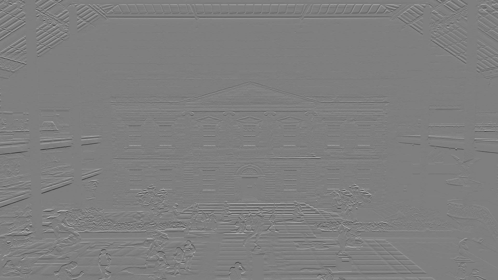

### [BME595 HW1] Implement 2D convolution
###### Li-Hsin Tseng, PUID: 0029033989

Source code: main.c, conv.py, main.py, README.md.

* Original Images
Two input images of size 1280x720, 1920x1080  

| Original Images |         1280x720          |         1920x1080          |
| --------------- |:-------------------------:| --------------------------:|
|                 | ||

* 5 kernels

K1 = [[-1, -1, -1], [0, 0, 0], [1, 1, 1]]  
K2 = [[-1,  0,  1], [-1, 0, 1], [-1, 0, 1]]  
K3 = [[1,  1,  1], [1, 1, 1], [1, 1, 1]]  
K4 = [[-1, -1, -1, -1, -1], [-1, -1, -1, -1, -1], [0, 0, 0, 0, 0], [1, 1, 1, 1, 1], [1, 1, 1, 1, 1]]  
K5 = [[-1, -1, 0, 1, 1], [-1, -1, 0, 1, 1], [-1, -1, 0, 1, 1], [-1, -1, 0, 1, 1], [-1, -1, 0, 1, 1]] 

* Kernel 1-3's effects on graph paper

> K1 extracts the horizontal lines of an image  
> K2 extracts the vertical lines of an image  
> K3 blurres the image

| Graph paper     |              | 
| --------------- |:------------:|
| Original Images |        |
| K1              || 
| K2              || 
| K3              ||  

##### Part A
* Task 1

| Task 1          | 1280x720     | 1920x1080  |
| --------------- |:------------:| ----------:|
| K1              |||

* Task 2

| Task 2          | 1280x720     | 1920x1080  |
| --------------- |:------------:| ----------:|
| K4              |||
| K5              |||

* Task 3

| Task 3          | 1280x720     | 1920x1080  |
| --------------- |:------------:| ----------:|
| K1              |||
| K2              |||
| K3              |||

#### Part B
As the value of o_channel goes up, the time of covolution increases approximately two times for o_channel = 2**(i+1) comparing to 2 ** i.
| Part B          | 1280x720     | 1920x1080  |
| --------------- |:------------:| ----------:|
| Time Plot(sec)  |||

#### Part C
The number of operations goes up as the kernel size increase.

| Part C           | 1280x720     | 1920x1080  |
| ---------------- |:------------:| ----------:|
| Times Plot(times)||| 

#### Part D
Using C to implement the convolution would take a lot less time comparing using python as the language.

| Part D          | 1280x720     | 1920x1080  |
| --------------- |:------------:| ----------:|
| Time Plot(sec)  |||

